# 🛡️ Threat Hunting & Detection Engineering Lab

**Threat hunting proactivo, ingeniería de detección, simulación de movimiento lateral y orquestación de respuesta — sobre un entorno corporativo simulado con Windows, Kali Linux y Wazuh**

**Estado:** Fase host-based + Snort + Kali + VirusTotal + orquestación con n8n + persistencia en SQLite + cadena de Credential Access (BITSAdmin/LSASS/Mimikatz) completa · **Wazuh:** 4.14.7 · **Framework:** MITRE ATT&CK

---

## 📋 Resumen ejecutivo

Este proyecto simula un entorno corporativo donde un endpoint Windows es atacado usando técnicas reales de *Living-off-the-Land* (LOLBins) y **movimiento lateral con un atacante externo real** (Kali Linux), correlacionadas a nivel de host (Sysmon + Wazuh), de red (Snort NIDS), enriquecidas con reputación de archivos (VirusTotal) y orquestadas de punta a punta con **n8n**, que automatiza la detección, el enriquecimiento y la notificación sin intervención manual.

El objetivo no es solo detectar — es **documentar el razonamiento de análisis**: qué se detectó, por qué, qué fue ruido, qué falló y por qué, y cómo se ajustó la detección con criterio profesional.

---

## 🏗️ Arquitectura

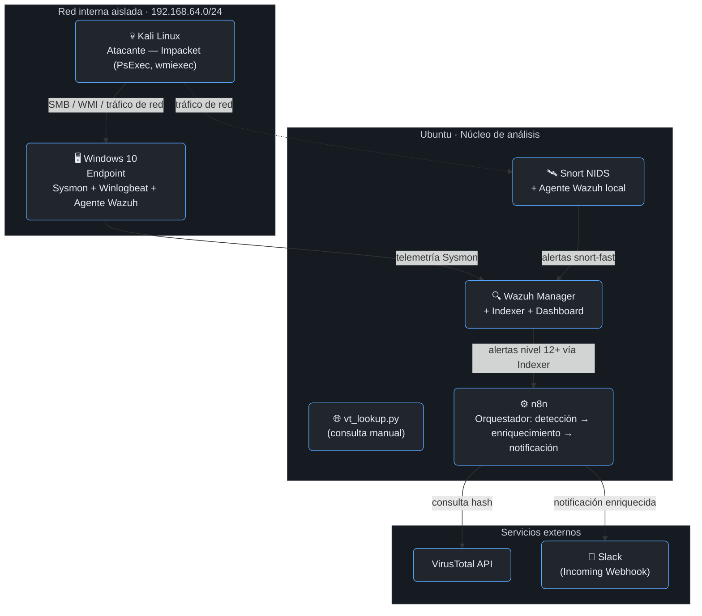

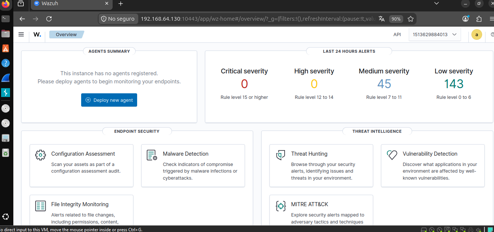
*Dashboard de Wazuh tras el despliegue inicial del stack.*

---

## 🧰 Stack tecnológico

| Componente | Herramienta | Rol |
|---|---|---|
| Generación de telemetría | Sysmon (config SwiftOnSecurity/Olaf Hartong) + Winlogbeat | Captura de eventos a nivel de host |
| SIEM / Correlación | Wazuh 4.14.7 (Docker) | Ingesta, reglas de detección, MITRE ATT&CK mapping |
| Simulación de ataques (host) | Atomic Red Team | Ejecución controlada y reproducible de técnicas ATT&CK |
| Simulación de ataques (red) | Kali Linux + Impacket | Movimiento lateral real (PsExec, WMI) desde un atacante externo |
| Detección de red | Snort 2.9 (NIDS nativo en Ubuntu) | Detección de patrones de red — User-Agent, IOCs de descarga, canales encubiertos |
| Threat Intelligence | VirusTotal API v3 | Reputación de archivos por hash — consulta manual (script) y automática (workflow n8n) |
| Orquestación | n8n (Docker) | Pipeline automático: detección → deduplicación → enriquecimiento → notificación |
| Persistencia | SQLite | Deduplicación e historial de alertas enriquecidas, consultable con SQL |
| Notificación | Slack (Incoming Webhook) | Alerta enriquecida al canal del equipo en tiempo real |

---

## 🎯 Cobertura MITRE ATT&CK

### Fase Host-Based (Atomic Red Team)

| Técnica | ID | Estado | Detección |
|---|---|---|---|
| PowerShell EncodedCommand | T1059.001 | ✅ Completo | Nativa (92071) + custom (100020) + Snort (User-Agent) |
| CertUtil (masquerading + decode) | T1140 | ✅ Completo | Nativa (92016 + 92017) |
| Rundll32 proxy execution | T1218.011 | ✅ Completo | Custom (100030) |
| Regsvr32 (Squiblydoo) | T1218.010 | ✅ Completo | Custom (100040) + Snort (.sct) |
| Scheduled Task persistence | T1053.005 | ✅ Completo | Custom (100050) |
| DLL Side-Loading (masquerading) | T1574.001¹ | ✅ Completo | Custom (100060) |
| Mshta | T1218.005 | ⚠️ Telemetría parcial² | — |

¹ *T1574.002 no tiene atomic público disponible; se sustituyó por T1574.001 (mismo mecanismo de fondo).*
² *Ver [Lecciones aprendidas](#-lecciones-aprendidas) — bug documentado del agente de Wazuh.*

### Fase Movimiento Lateral (Kali + Impacket)

| Técnica | ID | Estado | Detección |
|---|---|---|---|
| PsExec (SMB/ADMIN$) | T1569.002 | ✅ Completo | Nativa (92218) — AV bloqueó el binario antes de ejecutar |
| WMI remoto | T1047 | ✅ Completo | Custom (100070) — sin cobertura nativa, técnica sigilosa (AV no la detectó) |

### Fase Credential Access & Persistencia adicional (Atomic Red Team)

| Técnica | ID | Estado | Detección |
|---|---|---|---|
| BITSAdmin (transferencia de archivos vía BITS) | T1197 | ✅ Completo | Custom (100090) — sin cobertura nativa específica |
| LSASS Memory Access | T1003.001 | ⚠️ Prevención confirmada³ | Custom (100100) — diseñada, no validada con telemetría real |
| Mimikatz Indicators | T1003 | ⚠️ Prevención confirmada³ | Custom (100110) — diseñada, no validada con telemetría real |

³ *Windows Defender bloqueó la ejecución antes de que Sysmon generara el evento de creación de proceso — ver [Casos de detección: BITSAdmin, LSASS y Mimikatz](#-casos-de-detección--bitsadmin-lsass-y-mimikatz).*

---

## 📁 Estructura del repositorio

```
enterprise-threat-hunting-lab/
├── README.md
├── docs/
│   └── screenshots/
├── detections/
│   ├── local_rules_custom.xml          ← todas las reglas custom, consolidadas
│   ├── virustotal-enrichment/
│   │   ├── vt_lookup.py                ← consulta manual de un hash
│   │   └── wazuh_vt_enrich.py          ← script original — prototipo del workflow de n8n
│   ├── T1059.001-powershell-encoded/
│   ├── T1140-certutil-masquerade/
│   ├── T1218.011-rundll32/
│   ├── T1218.010-regsvr32-squiblydoo/
│   ├── T1053.005-scheduled-tasks/
│   ├── T1574.001-dll-sideloading/
│   ├── T1218.005-mshta-partial/
│   ├── T1569.002-psexec/
│   ├── T1047-wmi-lateral-movement/
│   ├── T1197-bitsadmin/
│   ├── T1003.001-lsass-access/
│   ├── T1003-mimikatz/
│   └── snort-nids/
│       └── local.rules                 ← reglas custom de Snort
├── n8n-workflows/
│   ├── soc-l2-workflow.json            ← export del workflow de orquestación
│   └── db/
│       └── soc_alerts.db               ← historial de alertas enriquecidas (SQLite)
└── lessons-learned.md
```

---

## 🔬 Casos de detección — Host (Sysmon + Wazuh)

### T1059.001 — PowerShell EncodedCommand
Regla nativa 92071 + custom 100020. Falsos positivos (`PSScriptPolicyTest`, `csc.exe`) resueltos con reglas de excepción.

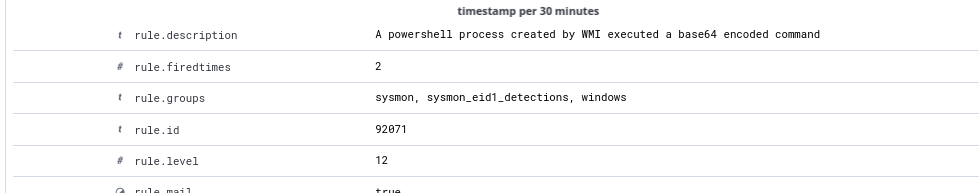
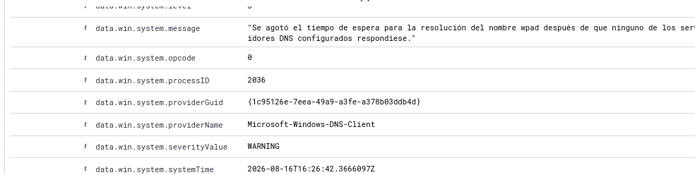

### T1140 — CertUtil masqueraded (rename + decode)
Test `T1140-2`: `certutil.exe` renombrado a `tcm.tmp`. `originalFileName` seguía delatando el binario real. **Dos reglas nativas** cubren el patrón: `92017` (decodificación) y `92016` (nombre distinto al esperado) — cobertura nativa robusta sin necesidad de regla propia.

### T1218.011 — Rundll32 proxy execution
Sin cobertura nativa. Regla custom `100030` cubre múltiples DLLs LOLBin conocidas.

### T1218.010 — Regsvr32 (Squiblydoo)
El test remoto fue bloqueado por Defender (`Trojan:Win32/Powemet.A!attk`).

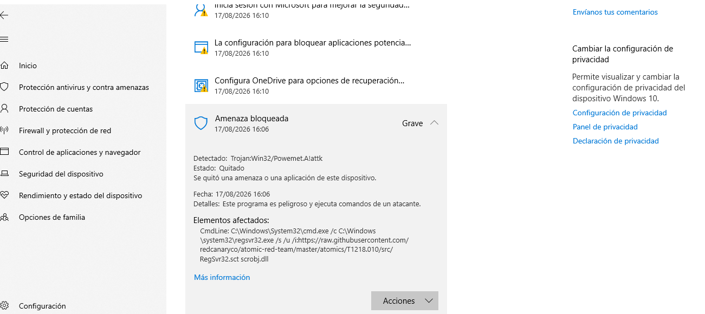

Regla custom `100040` detecta el patrón local o remoto.

### T1053.005 — Scheduled Task persistence
Regla custom `100050`, mapeando Execution + Persistence + Privilege Escalation.

### T1574.001 — DLL Side-Loading / masquerading (sustituto de T1574.002)
Regla custom `100060` detecta el binario legítimo fuera de su carpeta esperada.

### T1218.005 — Mshta (telemetría parcial)
Bloqueado por Defender en un intento; en otro, ejecutó pero el evento nunca llegó a Wazuh — ver causa raíz en Lecciones Aprendidas.

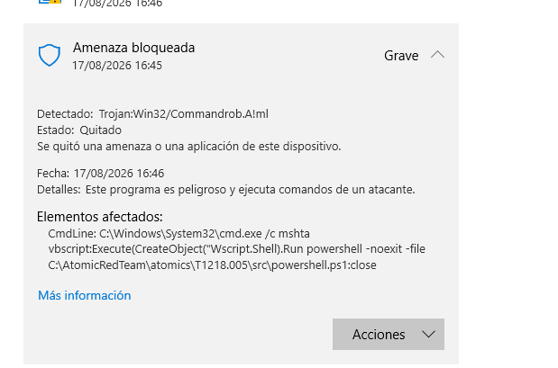

---

## 🗡️ Casos de detección — Movimiento lateral (Kali + Impacket)

### T1569.002 — PsExec (SMB Admin Shares)

Requirió deshabilitar `LocalAccountTokenFilterPolicy` (protección UAC remota que bloquea por defecto la escritura en `ADMIN$` con cuentas locales).

- **Windows Defender** detectó y puso en cuarentena el binario (`VirTool:Win32/RemoteExec!pz`) antes de que se ejecutara.
- **Wazuh** detectó igual, vía la regla nativa **92218** sobre el evento de creación de archivo — sin necesidad de regla propia.

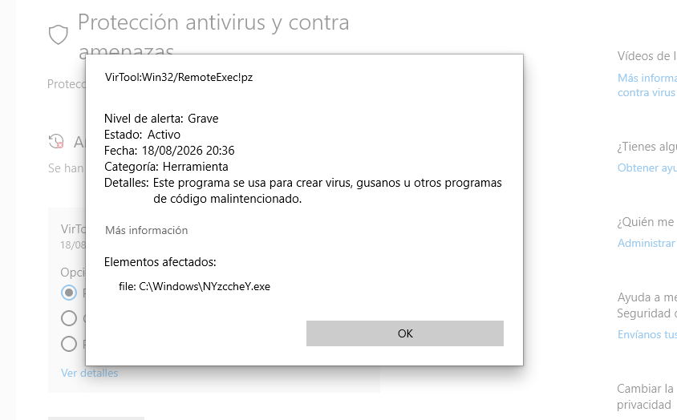
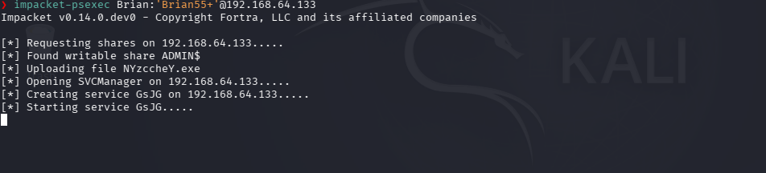

### T1047 — WMI remoto (Impacket wmiexec)

Requirió habilitar el grupo de firewall **"Instrumental de administración de Windows (WMI)"** (distinto al de SMB).

- **Windows Defender no detectó nada** — WMI no dropea binarios, usa `WmiPrvSE.exe` (100% legítimo).
- **Sin cobertura nativa en Wazuh.** Regla custom **100070** detecta el patrón característico de `wmiexec.py`: `cmd.exe` redirigiendo la salida a `ADMIN$\__<timestamp>` (necesario porque WMI no tiene canal de salida interactivo nativo).

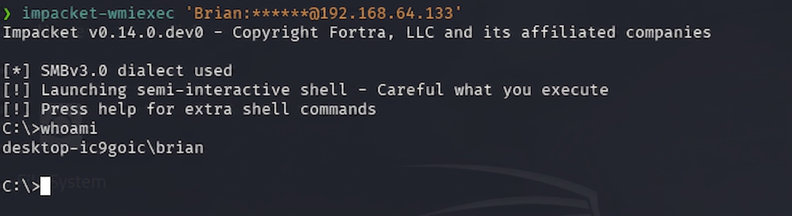

**Contraste documentado**: PsExec neutralizado por AV pero detectado por SIEM; WMI evadió AV pero fue detectado por comportamiento — dos técnicas, mismo objetivo, perfiles de detección opuestos.

---

## 🔑 Casos de detección — BITSAdmin, LSASS y Mimikatz

Tres técnicas de *Credential Access* y *Persistence/Defense Evasion* pensadas como una cadena narrativa: **BITSAdmin** (persistencia/descarga sigilosa vía un servicio legítimo de Windows) → **LSASS Access** (acceso a la memoria donde viven las credenciales) → **Mimikatz** (la herramienta que automatiza la extracción de esas credenciales) — el flujo típico de un atacante que ya tiene un punto de apoyo y busca escalar hacia movimiento lateral con credenciales robadas.

### T1197 — BITSAdmin (transferencia de archivos)

BITS (*Background Intelligent Transfer Service*) es un servicio legítimo de Windows para transferencias en segundo plano (lo usa Windows Update). Se abusa porque corre con privilegios del sistema, sobrevive reinicios, y recibe menos escrutinio que PowerShell o cmd — un LOLBin clásico para descargar payloads.

**Sin cobertura nativa real.** Las únicas reglas que dispararon fueron genéricas de nivel 4 (`92005` "Command shell started script with /c modifier", `92052` "Windows command prompt started by an abnormal process") — ninguna hace referencia a BITS, ambas disparan con cualquier `cmd /c`. Un analista sin regla dedicada no tendría forma de distinguir esto de tráfico inocuo.

Regla custom `100090` (nivel 12) detecta `bitsadmin.exe` con `/transfer` + `/download`/`/upload` en el command line, validada con éxito.

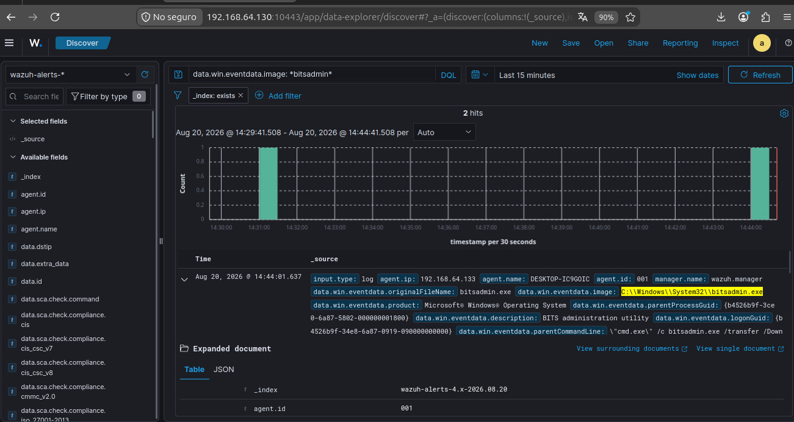

### T1003.001 — LSASS Memory Access

Test ejecutado: volcado de memoria de LSASS vía `rundll32.exe comsvcs.dll, MiniDump` — un patrón muy conocido de *Credential Dumping*.

**Windows Defender bloqueó el intento preventivamente**, con firma específica `Trojan:Win32/RundllLolBin.AF` — el nombre de la firma reconoce explícitamente el patrón LOLBin. El bloqueo ocurrió tan temprano que Sysmon **nunca llegó a generar el Event ID 1** (creación de proceso) — sin ese evento, Wazuh no tiene absolutamente nada que correlacionar.

Esto es un punto ciego real y honesto de documentar: si un atacante usara una variante que evada esa firma puntual de Defender, el SIEM quedaría completamente ciego ante el mismo ataque. Se cargó la regla custom `100100` (nivel 12) con el patrón esperado (`rundll32.exe` + `comsvcs.dll` + `MiniDump`), dejando explícito en la descripción que no pudo validarse con un evento real.

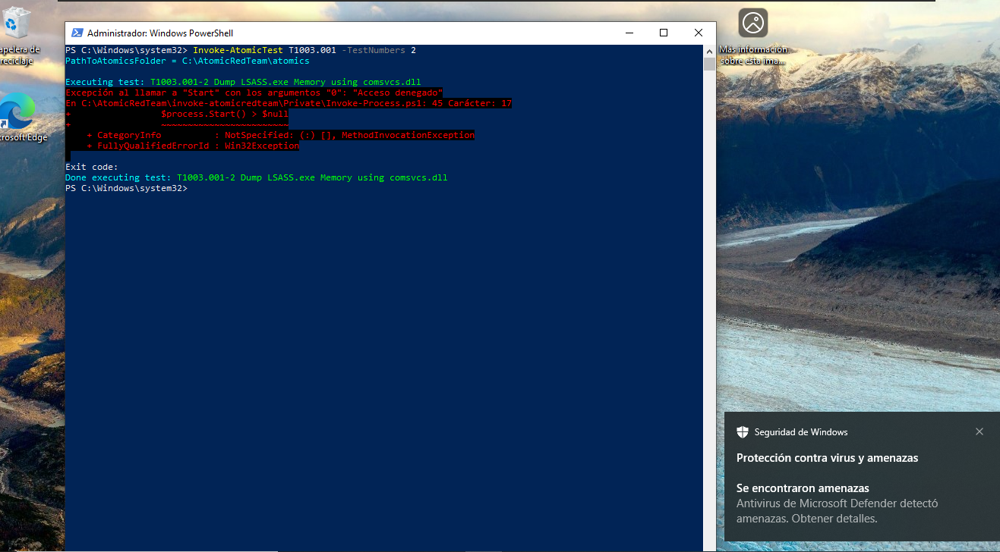

### T1003 — Mimikatz Indicators

Test ejecutado: `Invoke-Mimikatz -DumpCreds`, descargado en memoria vía `IEX + DownloadString` desde PowerSploit — la variante "sin archivo en disco" del ataque, pensada para evadir controles basados en firma de archivo.

**Mismo resultado que LSASS.** Windows Defender bloqueó el intento con firma `Trojan:PowerShell/Mimikatz.A` (mostrando el `CmdLine` completo en su propia alerta), y PowerShell devolvió `Acceso denegado` — el proceso no llegó a completarse, y Sysmon no capturó ningún evento correlacionable.

Se cargó igualmente la regla custom `100110` (nivel 14 — la más alta de todas las custom del proyecto, dado que la mención explícita de "Mimikatz" en un command line es una señal casi inequívoca), detectando `powershell.exe` con `downloadstring` + `mimikatz` en el command line, con la misma limitación documentada en su descripción.

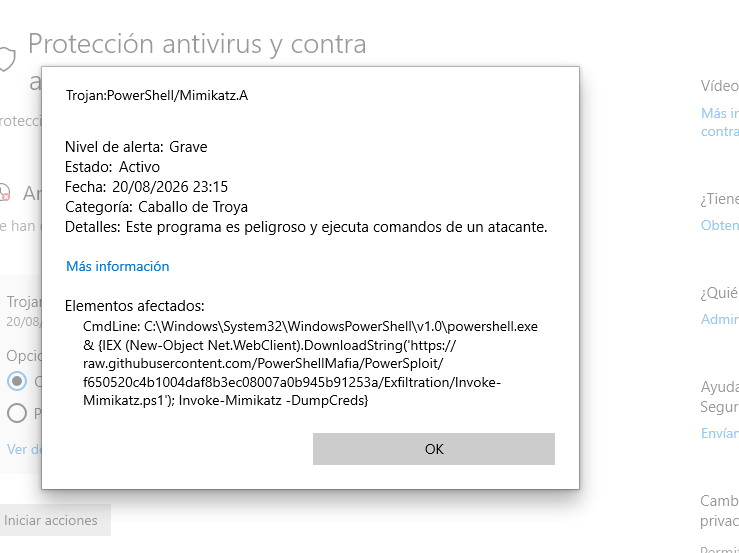

**Contraste con BITSAdmin**: BITSAdmin no tiene firma de AV, así que llegó a ejecutarse completo y generar telemetría real — la regla se pudo validar de punta a punta. LSASS y Mimikatz sí tienen firmas de AV muy maduras, así que la prevención ganó la carrera antes que la detección — mostrando en la práctica el trade-off entre técnicas "ruidosas mas invisibles para el AV" (WMI, BITSAdmin) y técnicas "silenciosas para el SIEM pero bloqueadas por el AV" (LSASS, Mimikatz).

---

## 🌐 Enriquecimiento con VirusTotal

Implementado como **scripts standalone en Python** en Ubuntu (`~/soc-l2-scripts`), diseñados como prototipo: la misma lógica de consulta se porta después a un nodo de n8n sin reescribir nada.

### `vt_lookup.py` — consulta manual de un hash

```
export VT_API_KEY="tu-api-key"
python3 vt_lookup.py <hash>
```

Validado con dos hashes reales de la sesión — `GUP.exe` y `schtasks.exe`, ambos limpios (0 detecciones en 74-75 motores), como corresponde a binarios legítimos. En ambos casos, VirusTotal reveló **nombres alternativos sospechosos** con los que esos mismos binarios circulan en el mundo real (`XClien1488t.bat.exe`, `Jh.exe`) — evidencia de que el patrón de masquerading que estudiamos hoy también ocurre en campañas reales.

### `wazuh_vt_enrich.py` — enriquecimiento automático

Consulta el Indexer de Wazuh (OpenSearch) por alertas de **nivel 12+** con hash asociado, extrae el SHA256, y lo enriquece vía la API de VirusTotal, con deduplicación local (`.vt_procesados.json`) y respeto del rate limit del tier gratuito (4 req/min).

Corrida completa sobre toda la sesión: **17 alertas procesadas, todas limpias** — y de paso reveló dos hallazgos no documentados hasta ese momento (ver más abajo).

---

## 🔍 Hallazgo adicional: falso positivo en regla nativa (61640)

Durante el enriquecimiento con VirusTotal apareció 3 veces una alerta no relacionada a ninguna técnica simulada: **regla `61640`** (*"Sysmon - Suspicious Process - explorer.exe"*, nivel 12, mapeada a **T1055 — Process Injection**).

**Investigación:** el patrón real era `svchost.exe -k DcomLaunch -p` lanzando `explorer.exe /factory,{CLSID} -Embedding` — el mecanismo **100% legítimo y estándar de Windows** para instanciar un servidor COM ("COM Surrogate"), usado por extensiones de shell, proveedores de miniaturas, etc. No es inyección de procesos real (que típicamente implica `CreateRemoteThread`/`QueueUserAPC` sobre un proceso ya corriendo, no una creación de proceso normal).

**Resolución:** regla de excepción **100080** (nivel 0) que silencia específicamente ese patrón (`svchost.exe` padre + `/factory,{CLSID} -Embedding`), sin afectar la regla `61640` original para casos genuinamente anómalos de `explorer.exe`.

---

## ⚙️ Orquestación con n8n — de script manual a pipeline automático

El script `wazuh_vt_enrich.py` funcionaba, pero requería ejecución manual, no tenía forma de notificar al equipo, y su lógica quedaba encerrada en código. El siguiente paso fue migrar esa misma lógica a un **workflow visual en n8n** (corriendo en Docker sobre la misma VM Ubuntu), agregando lo que un script standalone no resuelve por sí solo: ejecución automática recurrente, deduplicación persistente entre corridas, y notificación al equipo.

### El pipeline, nodo por nodo

| # | Nodo | Función |
|---|------|---------|
| 1 | **Schedule Trigger** | Dispara el workflow cada 5 minutos |
| 2 | **HTTP Request** (Indexer) | Consulta a Wazuh (OpenSearch) por alertas `rule.level >= 12` con hash de archivo asociado |
| 3 | **Split Out** | Separa el array de alertas en items individuales de n8n |
| 4 | **Code** (extracción) | Extrae el SHA256 vía regex y estructura los campos clave de cada alerta (regla, MITRE, imagen, comando) |
| 5 | **Filter** | Descarta alertas sin hash válido |
| 6 | **Code** (deduplicación) | Filtra alertas ya procesadas en corridas anteriores, usando el *static data* de n8n |
| 7 | **Loop Over Items** | Procesa las alertas de a una (batch size 1) |
| 8 | **HTTP Request** (VirusTotal) | Consulta la reputación del hash contra la API v3 de VT |
| 9 | **Code** (registro) | Marca la alerta como procesada en el static data |
| 10 | **Code** (formateo) | Arma el mensaje final con el resumen de VT (maliciosos/sospechosos/motores) |
| 11 | **HTTP Request** (Slack) | Envía la notificación al canal vía Incoming Webhook |
| 12 | **Wait (16s)** | Respeta el rate limit del tier gratuito de VT (4 req/min), y vuelve a alimentar el loop |


### Decisiones técnicas y desafíos resueltos

**Puerto del Indexer vs. Dashboard.** El primer intento de conexión devolvió un `404 Not Found` en vez de un error de conexión — señal de que el servidor respondía, pero no en la ruta esperada. Investigando los contenedores Docker (`docker ps`), se confirmó que el puerto expuesto inicialmente (10443) correspondía al **Wazuh Dashboard** (mapeado desde el puerto 5601 interno), no al **Indexer** — que corre en el 9200. Un buen recordatorio de que un código de error específico (404 vs. timeout) acota mucho más rápido el diagnóstico que "no conecta".

**Rate limiting fiel al script original.** El mismo `time.sleep(16)` del script se replicó con un patrón **Loop Over Items (batch size 1) → HTTP Request → Wait (16s) → vuelve al loop**, procesando un hash a la vez con la misma cadencia que respetaba el tier gratuito de VT.

**Deduplicación sin base de datos externa.** El script original usaba un archivo `.vt_procesados.json` local para no re-consultar hashes ya vistos. En n8n, el equivalente es el **static data del workflow** (`$getWorkflowStaticData('global')`), un storage persistente atado al propio workflow. Un detalle no documentado descubierto en el camino: el static data **solo persiste en ejecuciones de producción** (disparadas por el trigger real, con el workflow *publicado y activo*) — las ejecuciones manuales de prueba en el editor no lo graban, aunque el workflow esté guardado.

**Manejo de "sin registro en VirusTotal".** Un hash no encontrado en VT (archivo nunca antes visto) responde con `404`. En vez de dejar que esto corte el workflow, el nodo HTTP Request se configuró con **"Continue (using error output)"**, separando la respuesta en dos ramas (éxito / error) para tratar cada caso explícitamente — igual que el `try/except` del script original.

### Resultado en producción

- **Deduplicación validada**: la primera corrida procesó las 17 alertas de la sesión (≈4m 43s, respetando el rate limit); las corridas siguientes, sin alertas nuevas, terminan en ~100ms sin consultar VT ni consumir cuota.
- **Notificación validada**: las 17 alertas enriquecidas llegaron correctamente al canal de Slack configurado, con el resumen de VirusTotal, regla, técnica MITRE, imagen y hash de cada una.


### Demo en vivo: el pipeline completo reaccionando a una alerta nueva

Para verificar que el pipeline funciona como orquestador real (y no solo en la corrida inicial de las 17 alertas), se corrió de nuevo el Atomic Test de BITSAdmin con el Schedule Trigger activo, sin intervención manual — capturando las 4 etapas del ciclo:

1. **Wazuh genera la alerta nueva** (`rule.id: 100090`, nivel 12) al ejecutarse el test en la VM Windows.
2. **n8n la recoge en su próximo ciclo** (máx. 5 min después) y corre el pipeline completo — la ejecución tardó **34.6 segundos** (vs. los ~100-600ms de los ciclos vacíos cuando no hay alertas nuevas), señal clara de que esta vez sí procesó una alerta real, consultando VirusTotal.
3. **SQLite registra la alerta** con su resultado de VT y timestamp.
4. **Slack recibe la notificación** con el resumen enriquecido.

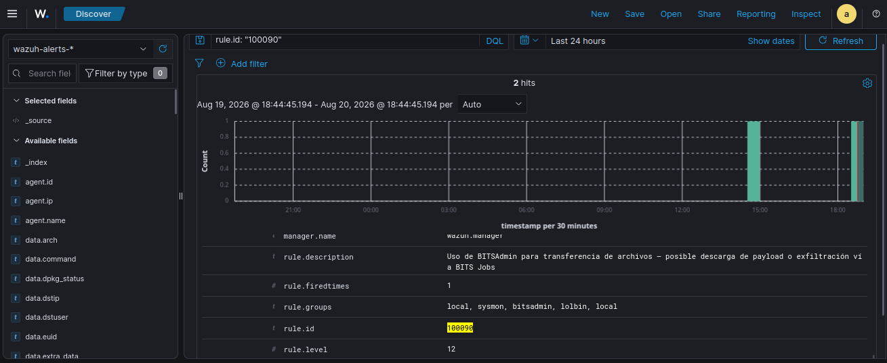
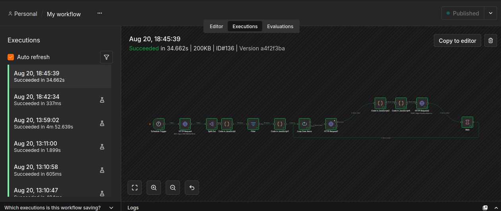
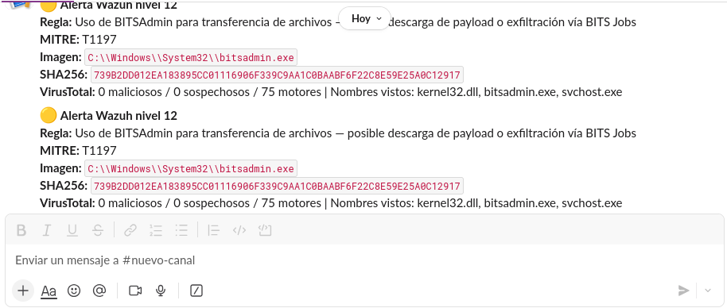

**Un detalle relevante sobre la deduplicación**: correr el mismo Atomic Test dos veces genera dos `alerta_id` distintos en Wazuh (aunque el hash del archivo sea idéntico) — la deduplicación de n8n opera sobre el **evento individual**, no sobre "la técnica ya fue vista antes". Esto es intencional y correcto: cada ejecución de un ataque es un evento nuevo que merece su propia notificación, aunque el análisis de reputación del archivo (VirusTotal) dé el mismo resultado que la vez anterior.

### Comparación con la versión en Python

| | Script (`wazuh_vt_enrich.py`) | Workflow en n8n |
|---|---|---|
| Ejecución | Manual (`python3 wazuh_vt_enrich.py`) | Automática, cada 5 minutos |
| Deduplicación | Archivo `.vt_procesados.json` → migrado a SQLite | Static data → migrado a SQLite |
| Rate limiting | `time.sleep(16)` | Loop + nodo Wait |
| Salida | `print()` en consola | Notificación en Slack |
| Mantenimiento | Requiere editar código Python | Editable visualmente, sin tocar código en la mayoría de los cambios |

---

## 🗄️ Migración a SQLite — deduplicación e historial persistente

El static data de n8n cumplía su función, pero es una solución de laboratorio: no es consultable con SQL, no sirve como historial, y (como se documenta más abajo) solo persiste en ejecuciones de producción, no en pruebas manuales. El siguiente paso fue reemplazarlo por una base de datos **SQLite** real — liviana, sin overhead de un servidor de base de datos corriendo en background, ideal para el volumen de este proyecto y para los recursos disponibles en la VM del lab (12 GB RAM / 4 núcleos).

Esta misma tabla cumple una doble función: **deduplicación** (no volver a consultar un hash ya procesado) e **historial completo consultable** de alertas enriquecidas — resolviendo de paso el pendiente de sumar un registro histórico, sin necesitar una herramienta externa como Google Sheets.

### Esquema de la base

```sql
CREATE TABLE alertas (
  alerta_id TEXT PRIMARY KEY,
  regla_id TEXT,
  nivel INTEGER,
  descripcion TEXT,
  mitre_id TEXT,
  imagen TEXT,
  sha256 TEXT,
  vt_maliciosos INTEGER,
  vt_sospechosos INTEGER,
  vt_total_motores INTEGER,
  vt_estado TEXT,
  fecha_procesado TEXT DEFAULT CURRENT_TIMESTAMP
);
```

### Cómo se integró con n8n

n8n no tiene un nodo nativo para SQLite (a diferencia de Postgres/MySQL), así que se manejó desde nodos **Code**, usando el módulo `sqlite3` de Node.js. Esto implicó resolver dos problemas de infraestructura antes de tocar la lógica:

**1. El contenedor de n8n no veía el archivo de la base.** n8n corre en Docker, con un único bind mount (`/home/brian/n8n-data` → `/home/node/.n8n`). La base de datos se ubicó directamente dentro de esa carpeta ya montada (`~/n8n-data/db/soc_alerts.db`), evitando tener que agregar un volumen nuevo y recrear el contenedor por ese motivo.

**2. n8n bloquea `require()` de módulos externos por seguridad.** Para permitir `sqlite3` dentro de los nodos Code, hizo falta:
- Instalar el módulo en una carpeta propia dentro del contenedor (no en el `package.json` interno de n8n, que usa el protocolo de workspaces `pnpm` y rechaza un `npm install` normal):
  ```bash
  docker exec -u root -it n8n mkdir -p /home/node/.n8n/custom-modules
  docker exec -u root -it n8n npm install sqlite3 --prefix /home/node/.n8n/custom-modules
  ```
- Recrear el contenedor (parar, eliminar y levantar de nuevo — sin pérdida de datos, ya que workflows y credenciales viven en el volumen montado) sumando dos variables de entorno: `NODE_PATH` apuntando a la carpeta del módulo, y `NODE_FUNCTION_ALLOW_EXTERNAL=sqlite3` para habilitar explícitamente su uso:
  ```bash
  docker run -d \
    --name n8n \
    -p 5678:5678 \
    -v /home/brian/n8n-data:/home/node/.n8n \
    -e N8N_BASIC_AUTH_ACTIVE=true \
    -e N8N_BASIC_AUTH_USER=admin \
    -e N8N_BASIC_AUTH_PASSWORD=SecretPassword \
    -e NODE_PATH=/usr/local/lib/node_modules:/home/node/.n8n/custom-modules/node_modules \
    -e NODE_FUNCTION_ALLOW_EXTERNAL=sqlite3 \
    docker.n8n.io/n8nio/n8n
  ```

### Los dos nodos reescritos

**Deduplicación** (reemplaza el chequeo contra static data — Mode: *Run Once for All Items*):

```javascript
const sqlite3 = require('sqlite3').verbose();
const path = '/home/node/.n8n/db/soc_alerts.db';

return new Promise((resolve, reject) => {
  const db = new sqlite3.Database(path, sqlite3.OPEN_READWRITE, (err) => {
    if (err) { reject(new Error('Error abriendo DB: ' + err.message)); return; }
    db.all('SELECT alerta_id FROM alertas', [], (err, rows) => {
      db.close();
      if (err) { reject(new Error('Error consultando: ' + err.message)); return; }
      const procesados = new Set(rows.map(r => r.alerta_id));
      const items = $input.all();
      const nuevos = items.filter(item => !procesados.has(item.json.alerta_id));
      resolve(nuevos);
    });
  });
});
```

**Registro e historial** (reemplaza el marcado en static data, ahora guarda también el resultado completo de VT — Mode: *Run Once for Each Item*):

```javascript
const sqlite3 = require('sqlite3').verbose();
const path = '/home/node/.n8n/db/soc_alerts.db';

const vtData = $json.data;
const alertaOriginal = $('Code in JavaScript').item.json;

let vtEstado, vtMaliciosos, vtSospechosos, vtTotalMotores;
if (!vtData) {
  vtEstado = 'sin_registro';
  vtMaliciosos = vtSospechosos = vtTotalMotores = null;
} else {
  const stats = vtData.attributes?.last_analysis_stats || {};
  vtEstado = 'ok';
  vtMaliciosos = stats.malicious ?? 0;
  vtSospechosos = stats.suspicious ?? 0;
  vtTotalMotores = Object.values(stats).reduce((a, b) => a + b, 0);
}

return new Promise((resolve, reject) => {
  const db = new sqlite3.Database(path, sqlite3.OPEN_READWRITE, (err) => {
    if (err) { reject(new Error('Error abriendo DB: ' + err.message)); return; }
    const sql = `INSERT OR REPLACE INTO alertas
      (alerta_id, regla_id, nivel, descripcion, mitre_id, imagen, sha256, vt_maliciosos, vt_sospechosos, vt_total_motores, vt_estado)
      VALUES (?, ?, ?, ?, ?, ?, ?, ?, ?, ?, ?)`;
    db.run(sql, [
      alertaOriginal.alerta_id, alertaOriginal.regla_id, alertaOriginal.nivel,
      alertaOriginal.descripcion, alertaOriginal.mitre_id, alertaOriginal.imagen,
      alertaOriginal.sha256, vtMaliciosos, vtSospechosos, vtTotalMotores, vtEstado
    ], (err) => {
      db.close();
      if (err) { reject(new Error('Error insertando: ' + err.message)); return; }
      resolve($json);
    });
  });
});
```

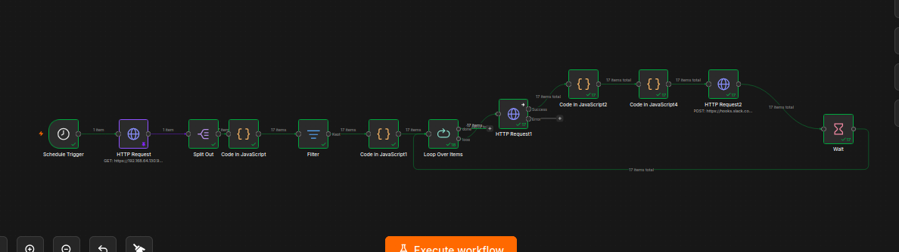

### Hallazgo: por qué VirusTotal reportó 0 detecciones en las 17 alertas

Al validar la migración, la tabla se llenó con `vt_estado = 'ok'` y `vt_maliciosos = 0` en las 17 filas — un resultado que a primera vista parece sospechoso, pero es exactamente el esperado. Las técnicas simuladas con Atomic Red Team son **LOLBins** (*Living-off-the-Land Binaries*): herramientas legítimas y firmadas de Microsoft (`certutil.exe`, `rundll32.exe`, `regsvr32.exe`, `powershell.exe`, `schtasks.exe`) usadas de forma inusual, no malware. VirusTotal consulta por hash del archivo, y el archivo es genuino — por eso 0 motores lo marcan como malicioso.

Esto ilustra bien un punto central del proyecto: **la reputación por hash no alcanza para detectar LOLBins**. Lo sospechoso no es el binario, es el *comportamiento* — el proceso padre, los argumentos de línea de comandos, el contexto de ejecución — que es exactamente lo que capturan las reglas de Wazuh sobre telemetría de Sysmon. El enriquecimiento con VT no reemplaza esa detección; la complementa, confirmando que la alerta no es un falso positivo por "archivo conocido como malicioso" sino que amerita revisión por comportamiento anómalo de una herramienta legítima.

---

## 📚 Lecciones aprendidas

- **El agente de Wazuh no lee Sysmon por defecto.** Hubo que agregar manualmente los canales al `ossec.conf` del agente.

- **Bug documentado y sin fix oficial del agente de Wazuh en Windows** (`EvtFormatMessage() ... 15029`). Reportado desde 2020, sin solución confirmada a fines de 2024. Reproducido dos veces, reaparece en ~20 minutos de sesión activa.

- **Las wildcard queries de OpenSearch sobre campos `keyword` son sensibles a mayúsculas/minúsculas.**

- **Windows Defender bloquea automáticamente firmas conocidas** (Mimikatz, Squiblydoo remoto, Mshta+VBScript+PowerShell, PsExec/Impacket) — pero **no todas las técnicas tienen firma**: WMI remoto pasó completamente desapercibido, dependiendo enteramente de detección por comportamiento.

- **Windows restringe por defecto el movimiento lateral con cuentas locales** vía `LocalAccountTokenFilterPolicy` — una protección real que detendría este ataque en un entorno corporativo bien configurado.

- **PsExec y WMI requieren grupos de firewall distintos**: "Compartir archivos e impresoras" (SMB) vs. "Instrumental de administración de Windows (WMI)" (DCOM/RPC).

- **El patrón de `wmiexec.py` es un IOC muy específico y detectable**: redirección de salida a `ADMIN$\__<timestamp epoch>`, visible en `ParentCommandLine` — una firma de comportamiento fiable aun sin firma de archivo.

- **No todo lo "sospechoso" es malicioso, incluso en reglas nativas del propio SIEM.** La regla `61640` de Wazuh genera falsos positivos con actividad DCOM completamente normal de Windows — un hallazgo que solo salió a la luz gracias al enriquecimiento automatizado con VirusTotal, mostrando el valor de la automatización para descubrir ruido que pasaría desapercibido revisando alertas una por una.

- **VirusTotal enriquece reputación de archivo; el SIEM detecta comportamiento.** `schtasks.exe` es y será siempre un binario limpio — la amenaza está en cómo se usa, no en el archivo en sí. Son capas complementarias, no sustitutas.

- **No todas las sub-técnicas de MITRE ATT&CK tienen atomics públicos.** T1574.002 no está disponible; se sustituyó documentando la ausencia.

- **Los NIDS sin inspección SSL no pueden ver dentro del tráfico HTTPS.**

- **Wazuh Manager en Docker no puede leer logs del host directamente sin bind-mount.** Se resolvió con un agente nativo de Wazuh en Ubuntu apuntando a `127.0.0.1`.

- **Un puerto que responde no significa el servicio correcto.** Un `404` (vs. timeout/connection refused) en la conexión al Indexer de Wazuh reveló que el puerto expuesto correspondía al Dashboard (5601→10443), no al Indexer real (9200) — ambos corriendo en contenedores Docker separados.

- **El "static data" de n8n solo persiste en ejecuciones de producción.** Las corridas manuales de prueba en el editor no graban los cambios al storage del workflow, aunque esté guardado — solo las ejecuciones disparadas por el propio trigger, con el workflow publicado y activo, persisten el estado entre corridas.

- **n8n restringe `require()` de módulos externos por seguridad, y no siempre se puede instalar en el lugar "obvio".** Instalar `sqlite3` directamente sobre el `package.json` interno de n8n falló por el protocolo de workspaces (`pnpm`) que usa internamente; hubo que instalarlo en una carpeta separada y exponerla vía `NODE_PATH` + `NODE_FUNCTION_ALLOW_EXTERNAL`.

- **Un cartel de error de UI no siempre significa un bug de lógica.** Una sesión de navegador con la conexión websocket trabada generó mensajes de "Node was not executed" que parecían un problema en el código del nodo — un simple refresh de página resolvió lo que en un primer momento parecía requerir depuración de la query SQL.

- **Un resultado "sospechoso" a veces es el correcto.** Que VirusTotal reporte 0 detecciones en herramientas usadas por Atomic Red Team no es un fallo del pipeline — es la confirmación esperada de que son binarios legítimos de Microsoft, y el motivo exacto por el que la detección de LOLBins necesita telemetría de comportamiento (Sysmon + Wazuh), no solo reputación de archivos.

- **Prevención y detección son capas distintas, y una no garantiza la otra.** Cuando el AV bloquea un ataque antes de que se cree el proceso, el SIEM se queda sin ningún evento que correlacionar — el ataque "no pasó", pero tampoco *se hubiera visto* si hubiera pasado. Documentar honestamente ese punto ciego (en vez de simplemente marcar la técnica como "detectada" porque el resultado final fue seguro) es más valioso que ocultarlo.

- **Al editar reglas custom en el contenedor de Wazuh Manager sin editores instalados** (imágenes mínimas sin `nano`/`vi`), la forma confiable es `docker cp` hacia/desde el host para editar ahí, y **siempre corregir permisos** después de copiar el archivo de vuelta (`chown wazuh:wazuh`, `chmod 660`) — de lo contrario el Manager falla en leerlo con un `Permission denied` silencioso, sin marcarlo como error de sintaxis, y sigue evaluando solo las reglas nativas sin avisar que la regla custom nunca se cargó.

---

## 🗺️ Roadmap

- [x] Completar las 6 técnicas LOLBin host-based
- [x] Instalar, validar e integrar Snort con Wazuh
- [x] Configurar Kali Linux como atacante y simular movimiento lateral (PsExec, WMI)
- [x] Implementar enriquecimiento con VirusTotal (script standalone, prototipo para n8n)
- [x] Instalar n8n y portar la lógica de `wazuh_vt_enrich.py` a un workflow visual con deduplicación y notificación a Slack
- [x] Migrar la deduplicación de static data a SQLite, con historial completo de alertas enriquecidas consultable por SQL
- [x] Sumar cadena de Credential Access/Persistence: BITSAdmin (T1197), LSASS Memory Access (T1003.001) y Mimikatz Indicators (T1003)

---

## 👤 Braian Fernandez

Portafolio de ciberseguridad.
